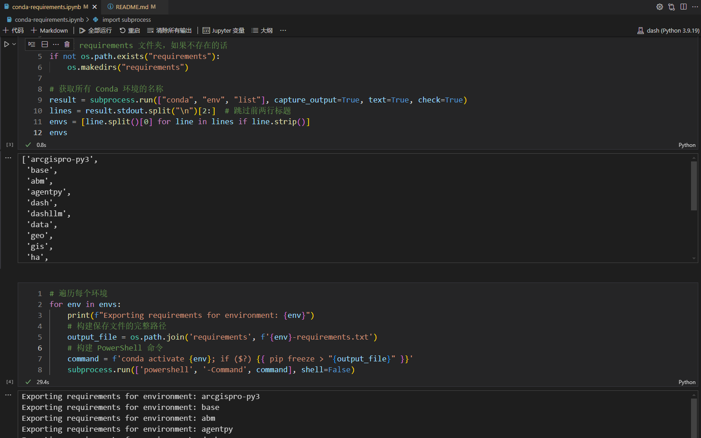
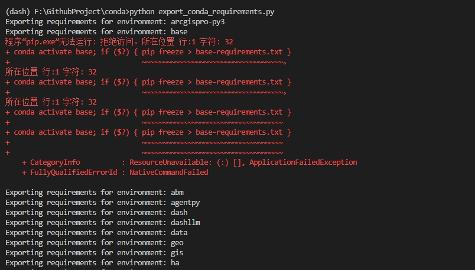

# conda-req-batch-exporter
Conda 环境依赖批量导出工具

导出所有conda环境的依赖，生成requirements.txt,conda.yml环境配置文件。轻松重现相同的环境，方便环境迁移、还原。

### 主要方法

```bash
# 已激活环境
pip freeze > requirements.txt
```


生成一个 YAML 文件，该文件涵盖了当前 Conda 环境里所有包的名称与版本信息。
```bash
# 已激活环境
conda env export > environment.yml
```

导出未激活的特定环境，可使用 -n 或者 --name 参数指定环境名称：
```bash
conda env export -n base > ./conda/base.yml
```

### notebook
requirements


### bash

```cmd
python export_conda_requirements.py
```

